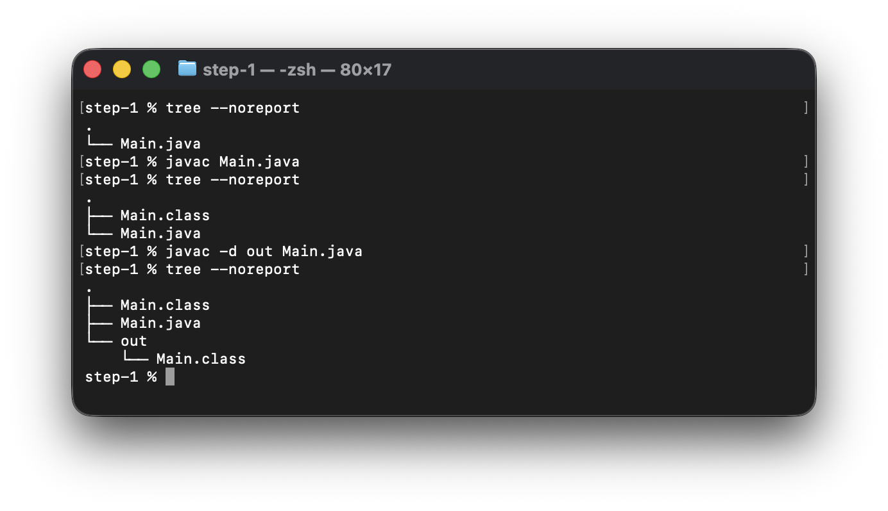
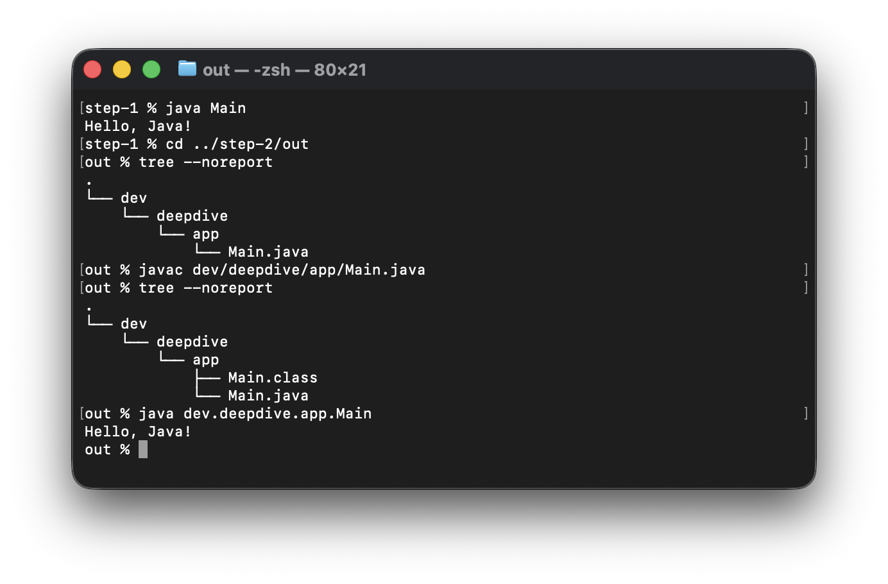
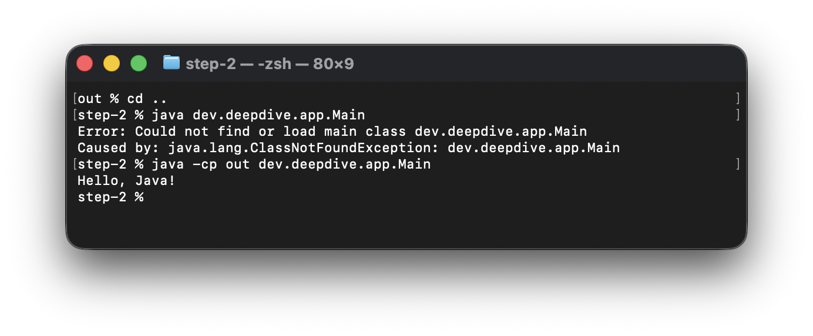
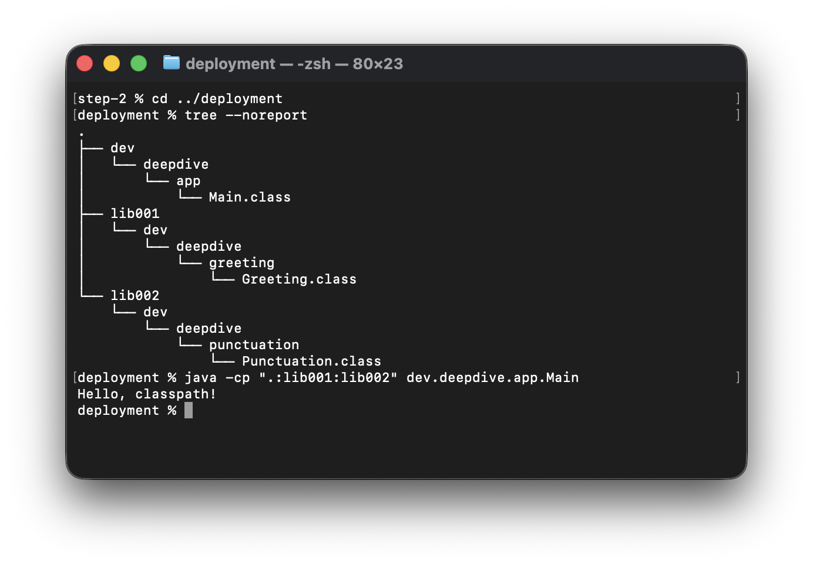
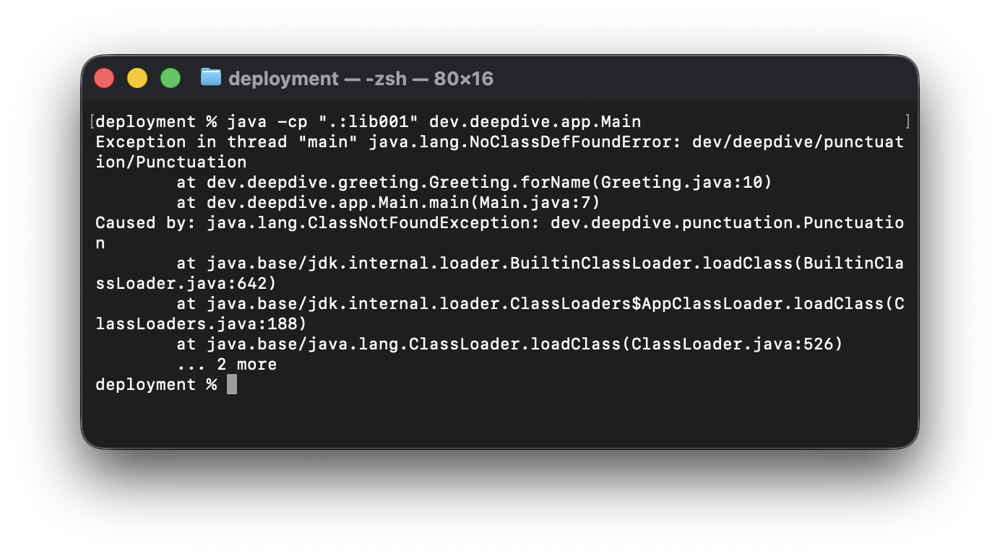

# 拆解 Java 启动：编译、类加载与 classpath

我们先把 Java 项目缩到最小：一个 `Main.java`，一套 JDK。不用 Eclipse 或 IntelliJ IDEA，不用 Maven，也不引入 Spring，编译和启动直接使用 `javac` 与 `java`。

沿着这条最短路径，我们逐步拆开程序的运行过程：写下的源码怎样变成 class 文件，传入的类名怎样对应到磁盘上的文件，以及 classpath 怎样决定这些文件能否被找到。

## 从 JDK 提供的工具开始

开发 Java 时，我们接触到的 JDK 和 JRE，区别就在于它们提供的能力：

- **JRE（Java Runtime Environment）** 提供运行 Java 程序所需的 JVM、类库和其他组件。
- **JDK（Java Development Kit）** 在运行环境的基础上，继续提供编译、调试、分析等开发工具。

作为开发者，我们既要运行程序，也要编译源码，因此日常使用的通常是 JDK。

> JRE 可以作为独立运行环境分发，是否提供独立安装包取决于发行版；应用也可以使用定制运行时。本文使用 JDK 提供的工具完成编译和启动。

我们熟悉的 `javac`，就是 JDK 提供的开发工具之一。它读取 `.java` 源文件，编译生成 `.class` 字节码文件。随后，我们用 `java` 命令启动 JVM，加载并执行编译结果：

```text
Java 源代码（.java）
        │
        │ javac
        ▼
Java 字节码（.class）
        │
        │ java
        ▼
JVM 加载并执行
```

## 用 javac 生成 class 文件

先写一个没有包声明的 `Main.java`，只保留我们熟悉的 `main` 方法和一行输出：

```java
public class Main {
    public static void main(String[] args) {
        System.out.println("Hello, Java!");
    }
}
```

当前目录只有这一个源文件：

```text
step-1/
└── Main.java
```

进入 `step-1`，执行编译：

```bash
javac Main.java
```

编译成功后，目录里多了一个 `Main.class`：

```text
step-1/
├── Main.class
└── Main.java
```

`javac` 默认把生成的 class 文件放在对应源文件旁边。如果我们想把编译结果单独放进一个目录，可以用 `-d` 指定输出位置。仍然留在 `step-1`，执行：

```bash
javac -d out Main.java
```

这条命令生成的是 `out/Main.class`，不影响刚才留在源文件旁的 `Main.class`。

```text
step-1/
├── Main.class
├── Main.java
└── out/
    └── Main.class
```

### 字节码：面向 JVM 的中间代码

`Main.class` 不是换了后缀的源码。编译器把 Java 源码转换成了面向 JVM 的中间代码，也就是字节码。

我们写源码时，用的是便于人阅读的 Java 语法；编译后，class 文件保存的则是 JVM 能够识别的指令和数据。它已经不是适合直接阅读的文本，但也不是 CPU 直接执行的机器码。

编译在这里划出了一条明确的边界：**JVM 不直接理解 Java 源码，它处理的是编译后符合 class 文件格式的数据。**

> Java 也支持 `java Main.java` 这样的单文件源码启动方式：启动器先在内存中编译源码，再执行编译结果。省略的是手动调用 `javac`，不是编译本身。本文把编译和启动分开，便于观察生成的文件。

下面是这轮编译实验的完整操作。我们用 `tree --noreport` 查看每次编译前后的目录变化：



## 从当前目录启动 Main

编译结果已经有了。我们留在 `step-1`，启动刚才编译的程序：

```bash
java Main
```

输出为：

```text
Hello, Java!
```

这里有个值得留意的细节：我们明明生成了 `Main.class`，启动时传入的却是类名 `Main`，不是文件名 `Main.class`。

为什么用类名，不用文件路径？先记下这个差别。给 `Main` 加上包声明后，它会更明显。

## 加上包名，再运行一次

我们另开一个 `step-2` 目录，像平时组织项目代码一样，把 `Main.java` 放进与包名对应的子目录。代码只增加一行包声明：

```java
package dev.deepdive.app;

public class Main {
    public static void main(String[] args) {
        System.out.println("Hello, Java!");
    }
}
```

源码放在最内层的 `app` 目录中：

```text
step-2/
└── out/
    └── dev/
        └── deepdive/
            └── app/
                └── Main.java
```

进入 `step-2/out`，在这个工作目录下编译：

```bash
javac dev/deepdive/app/Main.java
```

这次没有使用 `-d`，因此 `Main.class` 仍然生成在源文件旁边：

```text
out/  ← 当前工作目录
└── dev/
    └── deepdive/
        └── app/
            ├── Main.java
            └── Main.class
```

保持工作目录为 `out`，启动命令为：

```bash
java dev.deepdive.app.Main
```

输出仍然是 `Hello, Java!`。把刚才的两条命令放在一起看，我们传给 `javac` 的是源文件路径 `dev/deepdive/app/Main.java`，传给 `java` 的则是完整类名 `dev.deepdive.app.Main`。

对于这里的普通顶层类，`dev.deepdive.app.Main` 这种包含包名的完整类名，被称作类的**二进制名称**。在普通目录结构中，名称里的点会对应目录分隔，而末尾的 `Main` 对应 `Main.class`：

```text
dev.deepdive.app.Main
          │
          ▼
dev/deepdive/app/Main.class
```

从 `step-1` 中执行 `java Main`，到进入 `step-2/out` 编译并启动带包名的 `Main`，完整操作如下：



回到类名转换后的 `dev/deepdive/app/Main.class`，它看起来就是一个相对路径。但相对路径还缺一个信息：从哪个目录开始找？

要找到这个搜索起点，我们需要沿着刚才的启动命令再往下走一步。

## `java`、JVM 与类加载器

`java` 命令首先启动 JVM。程序执行所依赖的这套支撑机制，通常称为“运行时”；JVM 是 Java 运行时的核心。其他语言也有各自的运行时，实现方式各不相同。

我们在命令后面写下的 `dev.deepdive.app.Main`，则是在指定入口类：这次运行从它开始。

执行入口方法之前，需要先根据类名找到字节码，将其加载到内存，在 JVM 中建立对应的类。负责这项工作的组件，叫作**类加载器（ClassLoader）**。

如果把从普通目录中查找和加载类的逻辑提取出来，我们可以用下面这段伪代码描述它：

```text
relativePath = className.replace(".", "/") + ".class"

for each root in classpath:  // Why multiple roots? We'll come back to this.
    classFile = joinPath(root, relativePath)
    if classFile exists:
        bytes = read(classFile)
        return defineClass(className, bytes)

throw ClassNotFoundException
```

类名先被转换成相对路径，再与各个搜索起点拼接。找到文件后读取字节数据，通过 JVM 提供的能力定义出运行时的 `Class` 对象。完成启动所需的准备后，运行环境调用 `Main.main`，进入我们写下的代码。

这些搜索起点组成了 **classpath**。启动命令提供类名，类加载器负责把这个名称对应到实际文件，再交给 JVM 定义成类——这就是前面没有直接传文件路径的原因。

## classpath：给类名一个搜索起点

回到刚才的实验，我们一直留在 `step-2/out`，执行的是：

```bash
java dev.deepdive.app.Main
```

这个实验中的 classpath 默认使用当前工作目录，因此搜索从 `out` 这一层开始，沿着类名对应的目录找到 `Main.class`：

```text
step-2/
└── out/                  ← 搜索起点：当前工作目录
    └── dev/
        └── deepdive/
            └── app/
                ├── Main.java
                └── Main.class  ← 找到目标
```

现在我们保持类名和文件不动，只把工作目录切换到 `out` 的父目录 `step-2`，执行相同的启动命令：

```bash
cd ..
java dev.deepdive.app.Main
```

我们没有改代码，甚至连启动命令都没改，但默认搜索起点已经变了。把它与类名对应的 `dev/deepdive/app/Main.class` 拼起来，问题就落在了具体的路径上：

| 当前工作目录 | 默认会查找的文件位置 | 结果 |
| --- | --- | --- |
| `step-2/out` | `step-2/out/dev/deepdive/app/Main.class` | 文件存在 |
| `step-2` | `step-2/dev/deepdive/app/Main.class` | 文件不存在，路径中少了 `out` |

这些路径都以 `step-2` 的父目录为参照。实际文件一直在第一行的位置，所以第二次启动会报告：

```text
Error: Could not find or load main class dev.deepdive.app.Main
Caused by: java.lang.ClassNotFoundException: dev.deepdive.app.Main
```

我们不必为此切回 `out`。留在 `step-2`，用 `-cp` 明确告诉启动器从 `out` 开始查找：

```bash
java -cp out dev.deepdive.app.Main
```

程序恢复正常。`-cp` 设置 classpath；这里的 `out` 相对工作目录 `step-2` 解析，搜索起点回到 `step-2/out`。

**工作目录决定相对路径如何解析，classpath 决定查找类时从哪里开始。** `-cp` 接受相对路径，也接受绝对路径。

下面是这次切换工作目录后的完整操作：同一条启动命令先报告找不到主类，补上 `-cp out` 后恢复正常。



## classpath 可以包含多个搜索起点

现在回到前面伪代码里留下的那条注释：为什么这里用了 `for` 循环？刚才我们只指定了一个 `out`，但 classpath 可以包含多个搜索起点，`-cp` 也支持一次配置多个目录。

当我们想把自己写的代码和外部库分开管理时，多个起点就派上用场了。给刚才的程序加上两个依赖：我们写的 `Main` 调用外部库提供的 `Greeting`，`Greeting` 再调用另一个库中的 `Punctuation`。自己的类仍放在项目的包目录下，两个库分别放进 `lib001`、`lib002`：

```text
deployment/  ← 当前工作目录
├── dev/
│   └── deepdive/
│       └── app/
│           └── Main.class
├── lib001/
│   └── dev/
│       └── deepdive/
│           └── greeting/
│               └── Greeting.class
└── lib002/
    └── dev/
        └── deepdive/
            └── punctuation/
                └── Punctuation.class
```

`Greeting` 的包名由它的作者定义。`Greeting.java` 中的声明是：

```java
package dev.deepdive.greeting;
```

我们在 `Main` 中按照这个包名导入并使用它，和日常开发时一样：

```java
package dev.deepdive.app;

import dev.deepdive.greeting.Greeting;

public class Main {
    public static void main(String[] args) {
        System.out.println(Greeting.forName("classpath"));
    }
}
```

如果只从 `deployment` 开始找，`dev.deepdive.greeting.Greeting` 对应的路径是 `deployment/dev/deepdive/greeting/Greeting.class`。实际文件在 `deployment/lib001/dev/deepdive/greeting/Greeting.class`，多了一层 `lib001`，两者对不上。

看到中间多出的这一层，我们可能会想到在类名前补上 `lib001.`。这样虽然能让查找路径指向文件，但对方源码中的 `package` 没有 `lib001`，编译后的 class 文件记录的也是原来的完整类名。请求名称与文件内部的名称不一致，加载时会报告 `wrong name`。

`lib001` 属于我们的文件管理方式，不属于对方的包名。要调整的是搜索起点，不是类名。

在 `deployment` 下，把三个起点都交给 `-cp`：

```bash
java -cp ".:lib001:lib002" dev.deepdive.app.Main
```

这里指定了三个搜索起点：`.` 是当前的 `deployment`，`lib001` 和 `lib002` 是它下面的两个目录。在 macOS 和 Linux 中，多项路径用冒号 `:` 分隔；Windows 中则用分号 `;`，写成 `".;lib001;lib002"`。

查找每个类时，类加载器依次尝试这些起点。三个类最终分别在以下位置被找到：

| 要加载的类 | 在哪个起点找到 | 对应的 class 文件（相对 `deployment`） |
| --- | --- | --- |
| `dev.deepdive.app.Main` | `.` | `dev/deepdive/app/Main.class` |
| `dev.deepdive.greeting.Greeting` | `lib001` | `lib001/dev/deepdive/greeting/Greeting.class` |
| `dev.deepdive.punctuation.Punctuation` | `lib002` | `lib002/dev/deepdive/punctuation/Punctuation.class` |

这样，我们就能分开管理这些文件，同时保留各自的包目录树，不必修改代码中的包名和引用。程序输出为：

```text
Hello, classpath!
```

下面是完整操作：进入 `deployment`，确认三个类的存放位置，再指定三个搜索起点启动程序。



接着，我们故意漏掉 classpath 中的 `lib002`，其他条件不变：

```bash
java -cp ".:lib001" dev.deepdive.app.Main
```

程序能够找到并启动 `Main`，也能够找到 `Greeting`，但执行到需要 `Punctuation` 时会失败：

```text
java.lang.NoClassDefFoundError: dev/deepdive/punctuation/Punctuation
Caused by: java.lang.ClassNotFoundException: dev.deepdive.punctuation.Punctuation
```

我们没有删除 `Punctuation.class`，它还在磁盘上；缺失的是指向它的搜索起点。以后遇到这类错误，**除了确认 class 文件存在，还要核对“classpath 起点 + 类名对应路径”是否真正指向它。**

这次失败的完整输出如下，可以看到 `NoClassDefFoundError`，以及后面作为原因列出的 `ClassNotFoundException`，都指向缺失的 `Punctuation`：



> 除了 `-cp`，`CLASSPATH` 环境变量也可以提供默认搜索路径。命令中的 `-cp` 优先于这个环境变量；两者都没有设置时，才使用当前工作目录 `.`。本文前面的默认路径实验没有设置该变量，后面的实验则用 `-cp` 明确指定路径。

## 从本地运行到部署交付

程序已经在本地跑通了。如果要把它部署到另一台机器，我们需要交付的就是刚才运行时用到的那些文件。

在这个实验里，我们把 `deployment` 目录整体交付过去，在目标机器上准备兼容的 Java 运行环境，就可以从该目录执行相同的启动命令。命令读取的是编译后的 class 文件，因此不需要再提供 `.java` 源码。

Visual Basic（VB）等语言可以生成 EXE 可执行文件，再将编译产物部署到服务器，由脚本或调度程序启动。Java 也可以交付编译产物；本例交付的是 class 文件，由 JVM 加载和执行。[Visual Basic 编译产物说明](https://learn.microsoft.com/en-us/dotnet/visual-basic/reference/command-line-compiler/sample-compilation-command-lines)

这个实验只有三个类，按目录交付还很直观。但回到我们日常维护的项目，几百个类、多个外部库，以及配置和资源文件都要一起发布。每次逐项确认哪些文件需要交付、哪些需要更新，会越来越繁琐。我们自然会希望把相关文件打包成一个整体来管理。

**JAR** 就是一种这样的归档格式，用来打包一组 class 和资源文件。配置了启动入口的可执行 JAR，还可以通过 `java -jar` 启动。[JAR 文件规范](https://docs.oracle.com/en/java/javase/21/docs/specs/jar/jar.html)

部署到 Web 容器的应用还会用到 **WAR**：按照 Web 应用的约定组织类、依赖和 Web 资源，再交给容器部署运行。[Web 应用的 WAR 打包结构](https://docs.oracle.com/javaee/7/tutorial/packaging003.htm)

从直接启动 class 文件，到我们在项目中使用的可执行 JAR、Web 容器，文件的组织方式和启动入口在变，类仍然需要加载到 JVM 中执行。后续文章中，我们再分别拆开这些部署方式，追踪它们如何找到类、启动程序。

## 参考资料

- [Oracle Java SE 8 Platform Overview：JRE 与 JDK](https://docs.oracle.com/javase/8/docs/technotes/guides/)
- [Oracle JDK 21：`javac` 命令](https://docs.oracle.com/en/java/javase/21/docs/specs/man/javac.html)
- [Oracle JDK 21：`java` 命令与 classpath](https://docs.oracle.com/en/java/javase/21/docs/specs/man/java.html)
- [Oracle Java SE 21：`ClassLoader` API](https://docs.oracle.com/en/java/javase/21/docs/api/java.base/java/lang/ClassLoader.html)
- [Java 虚拟机规范 21：class 文件格式](https://docs.oracle.com/javase/specs/jvms/se21/html/)
- [Oracle JDK 21：创建定制 Java 运行时](https://docs.oracle.com/en/java/javase/21/jpackage/image-and-runtime-modifications.html)
- [JAR 文件规范](https://docs.oracle.com/en/java/javase/21/docs/specs/jar/jar.html)
- [Oracle：Web 应用的 WAR 打包结构](https://docs.oracle.com/javaee/7/tutorial/packaging003.htm)
- [Microsoft：Visual Basic 的编译产物](https://learn.microsoft.com/en-us/dotnet/visual-basic/reference/command-line-compiler/sample-compilation-command-lines)
