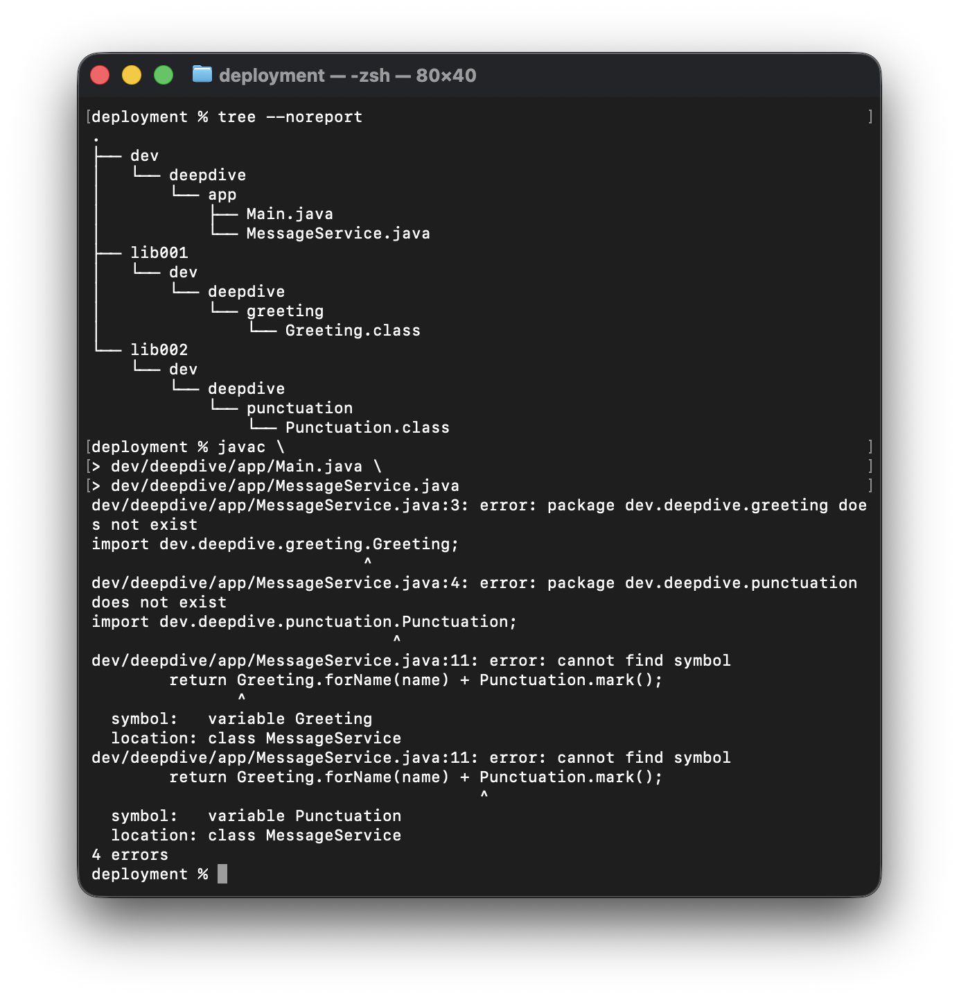
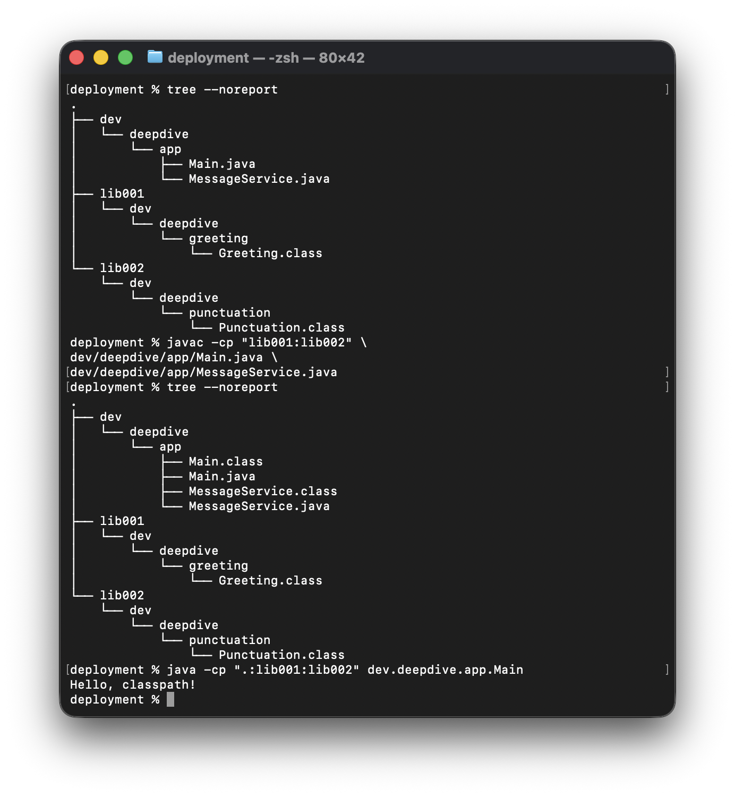
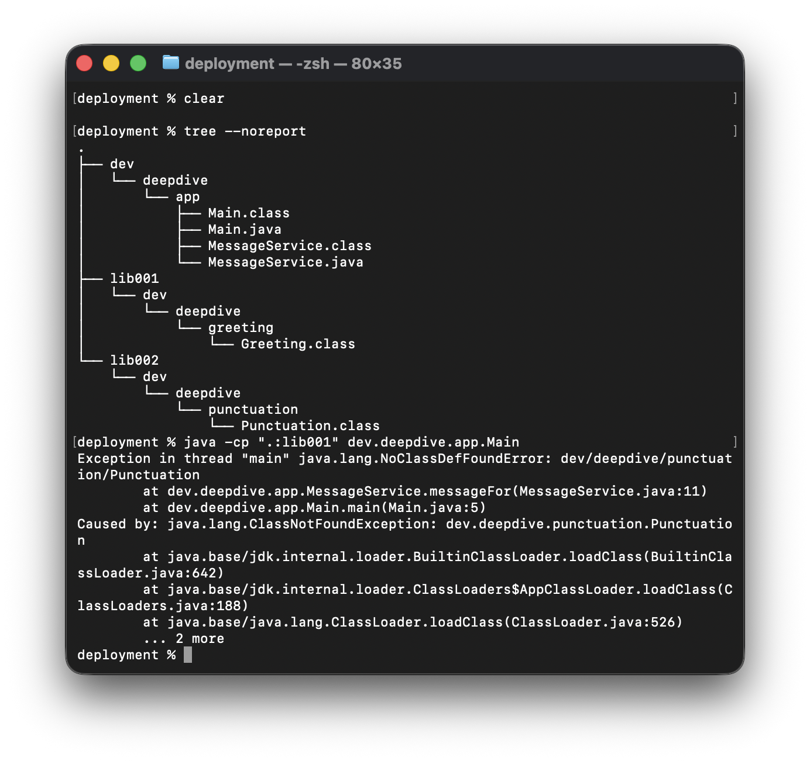

# 拆解 Java 启动：编译、类加载与 classpath

我们先把 Java 项目缩到最小：一个 `Main.java`，一套 JDK。不用 Eclipse 或 IntelliJ IDEA，不用 Maven，也不引入 Spring，编译和启动直接使用 `javac` 与 `java`。

沿着这条最短路径，我们逐步拆开程序的运行过程：写下的源码怎样变成 class 文件，传入的类名怎样对应到磁盘上的文件，以及 classpath 怎样分别决定编译和运行时从哪里查找依赖。

## 从 JDK 提供的工具开始

我们熟悉的 `javac` 和 `java` 都由 JDK 提供。本文用 `javac` 将 `.java` 源文件编译成 `.class` 字节码文件，再用 `java` 启动 JVM，加载并执行编译结果：

```text
Java 源代码（.java）
        │
        │ javac
        ▼
Java 字节码（.class）
        │
        │ java
        ▼
JVM 加载并执行
```

## 用 javac 生成 class 文件

先写一个没有包声明的 `Main.java`，只保留我们熟悉的 `main` 方法和一行输出：

```java
public class Main {
    public static void main(String[] args) {
        System.out.println("Hello, Java!");
    }
}
```

当前目录只有这一个源文件：

```text
step-1/
└── Main.java
```

进入 `step-1`，执行编译：

```bash
javac Main.java
```

编译成功后，目录里多了一个 `Main.class`：

```text
step-1/
├── Main.class
└── Main.java
```

`javac` 默认把生成的 class 文件放在对应源文件旁边。如果我们想把编译结果单独放进一个目录，可以用 `-d` 指定输出位置。仍然留在 `step-1`，执行：

```bash
javac -d out Main.java
```

这条命令生成的是 `out/Main.class`，不影响刚才留在源文件旁的 `Main.class`。

```text
step-1/
├── Main.class
├── Main.java
└── out/
    └── Main.class
```

### 字节码：面向 JVM 的中间代码

`Main.class` 不是换了后缀的源码。编译器把 Java 源码转换成了面向 JVM 的中间代码，也就是字节码。

我们写源码时，用的是便于人阅读的 Java 语法；编译后，class 文件保存的则是 JVM 能够识别的指令和数据。它已经不是适合直接阅读的文本，但也不是 CPU 直接执行的机器码。

编译在这里划出了一条明确的边界：**JVM 不直接理解 Java 源码，它处理的是编译后符合 class 文件格式的数据。**

下面是这轮编译实验的完整操作。我们用 `tree --noreport` 查看每次编译前后的目录变化：


## 从当前目录启动 Main

编译结果已经有了。我们留在 `step-1`，启动刚才编译的程序：

```bash
java Main
```

输出为：

```text
Hello, Java!
```

至此，我们完成了最小的一轮编译和运行。不过，编译不只是转换代码的形式：`javac` 还需要根据类和方法的声明，检查源码中的类引用和方法调用是否成立。到了运行阶段，JVM 则需要加载实际参与执行的字节码。两步都需要找到我们使用的类，但目的不同。

这里有个值得留意的细节：我们明明生成了 `Main.class`，启动时传入的却是类名 `Main`，不是文件名 `Main.class`。

为什么用类名，不用文件路径？先记下这个差别。给 `Main` 加上包声明后，它会更明显。

## 加上包名，再运行一次

我们另开一个 `step-2` 目录，像平时组织项目代码一样，把 `Main.java` 放进与包名对应的子目录。代码只增加一行包声明：

```java
package dev.deepdive.app;

public class Main {
    public static void main(String[] args) {
        System.out.println("Hello, Java!");
    }
}
```

源码放在最内层的 `app` 目录中：

```text
step-2/
└── out/
    └── dev/
        └── deepdive/
            └── app/
                └── Main.java
```

进入 `step-2/out`，在这个工作目录下编译：

```bash
javac dev/deepdive/app/Main.java
```

这次没有使用 `-d`，因此 `Main.class` 仍然生成在源文件旁边：

```text
out/  ← 当前工作目录
└── dev/
    └── deepdive/
        └── app/
            ├── Main.java
            └── Main.class
```

保持工作目录为 `out`，启动命令为：

```bash
java dev.deepdive.app.Main
```

输出仍然是 `Hello, Java!`。把刚才的两条命令放在一起看，我们传给 `javac` 的是源文件路径 `dev/deepdive/app/Main.java`，传给 `java` 的则是完整类名 `dev.deepdive.app.Main`。

对于这里的普通顶层类，`dev.deepdive.app.Main` 这种包含包名的完整类名，被称作类的**二进制名称**。在普通目录结构中，名称里的点会对应目录分隔，而末尾的 `Main` 对应 `Main.class`：

```text
dev.deepdive.app.Main
          │
          ▼
dev/deepdive/app/Main.class
```

从 `step-1` 中执行 `java Main`，到进入 `step-2/out` 编译并启动带包名的 `Main`，完整操作如下：


回到类名转换后的 `dev/deepdive/app/Main.class`，它看起来就是一个相对路径。但相对路径还缺一个信息：从哪个目录开始找？

## classpath：给类名一个搜索起点

本文中的应用类都以 class 文件的形式放在普通目录中。要根据类名找到它们，需要先确定从哪些目录开始查找。这组查找位置由 **classpath** 指定：**一个 classpath 可以包含多个条目；在本文中，每个条目都是一个目录，也就是类文件的搜索起点。**

classpath 并不只用于启动程序。编译器需要查找依赖类的声明，运行时需要查找参与执行的字节码，两者分别使用各自的 classpath 配置。`javac -cp` 配置编译阶段的查找位置，`java -cp` 配置运行阶段的查找位置。

我们先沿着刚才的 `java` 命令，观察运行阶段怎样使用这些搜索起点。

### `java`、JVM 与类加载器

`java` 命令首先启动 JVM。理解 Java 的底层机制时，我们会反复遇到“运行时（runtime）”这个词。这里，它指的是支撑程序执行的一套机制，JVM 是 Java 运行时的核心。接下来要看的类加载，就是其中一项工作。

我们在命令后面写下的 `dev.deepdive.app.Main`，则是在指定入口类：这次运行从它开始。

执行入口方法之前，需要先根据类名找到字节码，将其加载到内存，在 JVM 中建立对应的类。负责这项工作的组件，叫作**类加载器（ClassLoader）**。

针对本文这种从普通目录中查找应用类的场景，我们可以用下面这段伪代码描述运行时的查找和加载过程：

```text
relativePath = className.replace(".", "/") + ".class"

for each entry in classpath:  // Why multiple entries? We'll come back to this.
    classFile = joinPath(entry, relativePath)
    if classFile exists:
        bytes = read(classFile)
        return defineClass(className, bytes)

throw ClassNotFoundException
```

类名先被转换成相对路径，再与 classpath 中的各个目录条目拼接。找到文件后读取字节数据，`defineClass` 会检查请求的类名是否与文件内部记录的类名一致，并通过 JVM 提供的能力定义出运行时的 `Class` 对象。完成启动所需的准备后，运行环境调用 `Main.main`，进入我们写下的代码。

这样，我们就能把前面的启动参数理解清楚：`java` 接收的是要启动的类名，classpath 提供查找位置，类加载器负责将两者对应到实际文件。类名确定我们要用哪个类，查找位置则由 classpath 配置。

### 用 `java -cp` 明确搜索起点

回到刚才的实验，我们一直留在 `step-2/out`，执行的是：

```bash
java dev.deepdive.app.Main
```

这个实验没有额外配置 classpath，默认只有一个条目 `.`，表示当前工作目录。因此搜索从 `out` 这一层开始，沿着类名对应的目录找到 `Main.class`：

```text
step-2/
└── out/                  ← 搜索起点：当前工作目录
    └── dev/
        └── deepdive/
            └── app/
                ├── Main.java
                └── Main.class  ← 找到目标
```

现在我们保持类名和文件不动，只把工作目录切换到 `out` 的父目录 `step-2`，执行相同的启动命令：

```bash
cd ..
java dev.deepdive.app.Main
```

我们没有改代码，甚至连启动命令都没改，但默认搜索起点已经变了。把 `.` 展开成当时的工作目录，再拼上类名对应的路径，从 `step-2` 这一层写起，就能直接看出差别：

| 当前工作目录 | 默认 classpath 条目 | 实际查找路径 | 结果 |
| --- | --- | --- | --- |
| `step-2/out` | `.` | `step-2/out/dev/deepdive/app/Main.class` | 文件存在 |
| `step-2` | `.` | `step-2/dev/deepdive/app/Main.class` | 文件不存在 |

两次启动使用的默认 classpath 都是 `.`，但 `.` 始终表示当时的工作目录。工作目录从 `step-2/out` 变成 `step-2` 后，类加载器实际搜索的位置也随之改变。文件没有移动，所以第二次启动会报告：

```text
Error: Could not find or load main class dev.deepdive.app.Main
Caused by: java.lang.ClassNotFoundException: dev.deepdive.app.Main
```

我们不必为此切回 `out`。留在 `step-2`，用 `-cp` 明确告诉启动器从 `out` 开始查找：

```bash
java -cp out dev.deepdive.app.Main
```

程序恢复正常。`-cp out` 将这次启动的 classpath 设置为只有 `out` 这一个条目。这里的 `out` 相对工作目录 `step-2` 解析，搜索起点回到 `step-2/out`。

**工作目录决定 classpath 中相对路径如何解析，classpath 的目录条目决定查找类时从哪里开始。** 条目可以使用相对路径，也可以使用绝对路径。

下面是这次切换工作目录后的完整操作：同一条启动命令先报告找不到主类，补上 `-cp out` 后恢复正常。


## 一个 classpath 可以包含多个条目

现在回到前面伪代码里留下的那条注释：为什么这里用了 `for` 循环？刚才的 classpath 只有一个 `out` 条目，但一个 classpath 可以包含多个条目，查找时依次尝试它们。

比如，我们拿到了别人编译好的 `Greeting.class` 和 `Punctuation.class`，想把它们与自己的代码分开存放，就可以分别放进 `lib001`、`lib002`。

这次也把我们自己的代码拆成两个源文件：`Main.java` 负责启动，同包中的 `MessageService.java` 负责组合消息。我们进入下面的 `deployment` 目录，接下来的编译和运行都在这里进行：

```text
deployment/  ← 当前工作目录
├── dev/
│   └── deepdive/
│       └── app/
│           ├── Main.java
│           └── MessageService.java
├── lib001/
│   └── dev/
│       └── deepdive/
│           └── greeting/
│               └── Greeting.class
└── lib002/
    └── dev/
        └── deepdive/
            └── punctuation/
                └── Punctuation.class
```

先看 `Main.java`：

```java
package dev.deepdive.app;

public class Main {
    public static void main(String[] args) {
        System.out.println(MessageService.messageFor("classpath"));
    }
}
```

再看同一个包中的 `MessageService.java`：

```java
package dev.deepdive.app;

import dev.deepdive.greeting.Greeting;
import dev.deepdive.punctuation.Punctuation;

final class MessageService {
    private MessageService() {
    }

    static String messageFor(String name) {
        return Greeting.forName(name) + Punctuation.mark();
    }
}
```

两个外部类的用法已经由提供方确定：`Greeting.forName("classpath")` 返回 `Hello, classpath`，`Punctuation.mark()` 返回 `!`。`MessageService` 直接使用这两个类，把它们的结果拼在一起：

```text
Main
└── MessageService
    ├── Greeting
    └── Punctuation
```

### 编译器也需要查找依赖

编译器不只是把源码“翻译”成字节码。`javac` 还会做语法检查，并确认源码中的类型和依赖引用是否合法。

比如 `MessageService` 中的 `Greeting.forName(name)`：编译器首先得找到 `Greeting` 的声明，再检查它是否提供了可访问的 `forName` 方法、能否接收这里的参数，以及返回值能否参与后面的表达式。对 `Punctuation.mark()` 也一样。

这些检查需要用到类和方法的声明。我们自己的两个类，可以从本次交给 `javac` 的源码中获得声明；两个外部类没有源码，就需要读取 `Greeting.class` 和 `Punctuation.class` 中的类型信息。**这里读取的是声明，不会执行 `Greeting.forName` 或 `Punctuation.mark`。**

仍在 `deployment` 下，把两个源码文件一起交给 `javac`。先不配置编译阶段的 classpath：

```bash
javac \
  dev/deepdive/app/Main.java \
  dev/deepdive/app/MessageService.java
```

这次编译失败，关键报错是：

```text
package dev.deepdive.greeting does not exist
package dev.deepdive.punctuation does not exist
```

`Main.java` 和 `MessageService.java` 都已经明确交给编译器了，缺少的是两个外部类的位置。默认从当前目录开始查找时，编译器找不到 `dev/deepdive/greeting/Greeting.class` 和 `dev/deepdive/punctuation/Punctuation.class`；它们实际分别在 `lib001`、`lib002` 下面。

下面是这次编译失败的完整操作。两个外部 class 文件已经在目录中，但编译器还没有得到它们的搜索起点：



### 用 `javac -cp` 补上依赖的搜索起点

现在用 `javac -cp` 把 `lib001`、`lib002` 这两个目录条目交给编译器，再执行一次。在 macOS 和 Linux 中，条目之间用冒号 `:` 分隔；Windows 中则用分号 `;`，这里应写成 `"lib001;lib002"`。

```bash
javac -cp "lib001:lib002" \
  dev/deepdive/app/Main.java \
  dev/deepdive/app/MessageService.java
```

这次编译器能够找到两个外部类的声明，完成对源码的检查。编译成功后，两个 class 文件默认生成在对应的源码旁边：

```text
deployment/
├── dev/
│   └── deepdive/
│       └── app/
│           ├── Main.java
│           ├── Main.class
│           ├── MessageService.java
│           └── MessageService.class
├── lib001/
│   └── dev/
│       └── deepdive/
│           └── greeting/
│               └── Greeting.class
└── lib002/
    └── dev/
        └── deepdive/
            └── punctuation/
                └── Punctuation.class
```

虽然 `Main` 要调用 `MessageService`，但我们不必先手动编译 `MessageService.java`。**同一次 `javac` 调用中明确列出的源码会成组编译，文件顺序不影响它们之间声明的解析。** 两个文件交换位置，仍然可以完成这次编译。

### 把 `lib001` 写进 `import` 呢？

编译已经通过。回头看这个目录结构，也许我们会想到另一种省事的写法：不配置 `-cp`，直接把 `MessageService` 里的 `import` 改成与存放目录一致的样子：

```diff
-import dev.deepdive.greeting.Greeting;
-import dev.deepdive.punctuation.Punctuation;
+import lib001.dev.deepdive.greeting.Greeting;
+import lib002.dev.deepdive.punctuation.Punctuation;
```

这样让编译器从当前的 `deployment` 目录开始找，看起来正好能找到两个 class 文件。但找到文件，只完成了一半。

以 `Greeting` 为例，别人编写它时，声明的包是 `dev.deepdive.greeting`。编译后的 `Greeting.class` 内部已经记录了完整类名 `dev.deepdive.greeting.Greeting`。我们把文件放进 `lib001`，不会给它的包名加上一层 `lib001`；修改自己源码中的 `import`，也不会改写这个 class 文件。

把修改后的查找过程展开，就能看到冲突在哪里：

```text
import 请求的类名
lib001.dev.deepdive.greeting.Greeting
                  │
                  ▼
从 deployment 开始，找到文件
lib001/dev/deepdive/greeting/Greeting.class
                  │
                  ▼
文件内部记录的类名
dev.deepdive.greeting.Greeting
                  │
                  ▼
类名不一致 → 编译失败
```

这次在编译阶段就会被拒绝，编译器会报告 `class file contains wrong class`：文件确实找到了，但里面的类不是 `import` 请求的那个。`Punctuation` 也是同样的问题。

所以我们保留原来的 `import`，用 `-cp "lib001:lib002"` 调整搜索起点。**classpath 决定去哪里找类，`import` 指明源码引用的是哪个类；修改 `import`，不能给外部类重命名。**

### 运行时仍要单独配置 classpath

刚才的 `-cp` 告诉了编译器去哪里读取依赖。现在字节码已经生成，启动程序时，我们还需要告诉运行时去哪里加载这些类。**`java` 不会自动继承刚才 `javac -cp` 的设置。**

我们仍在 `deployment` 下，这次把自己的 class 文件和外部依赖的搜索起点一起交给 `java`：

```bash
java -cp ".:lib001:lib002" dev.deepdive.app.Main
```

这里配置的是**一个 classpath，包含三个条目**：`.`、`lib001`、`lib002`。

### 为什么运行时的 classpath 多了一个 `.`

对照刚才的编译命令，`javac -cp` 后面只有 `"lib001:lib002"`，这里却变成了 `".:lib001:lib002"`。多出来的 `.`，是我们把当前的 `deployment` 目录也列为搜索起点，并不是改变工作目录。

编译时，我们已经把 `Main.java` 和 `MessageService.java` 的文件路径直接交给了 `javac`。它不需要再通过 classpath 寻找这两份输入源码，因此这条命令只需用 classpath 补上两个外部依赖的位置。加入 `.` 也可以，只是本次编译不需要它。

运行时不同。我们只给了 `java` 一个入口类名 `dev.deepdive.app.Main`，没有直接给它文件路径。类加载器需要自己找到 `Main.class`，以及程序用到的 `MessageService.class`。这两个文件都位于 `deployment/dev/deepdive/app/` 下，所以要从 `deployment` 这一层，也就是 `.`，开始查找。

**显式设置 `-cp` 后，使用的就是列出的那些条目，不会自动附加默认的 `.`。** 如果这里只写 `"lib001:lib002"`，类加载器不会再从 `deployment` 这一层查找，连入口类 `Main` 都无法找到。

每个目录条目都作为类文件的搜索起点。四个类分别在以下位置被找到：

| 要加载的类 | 在哪个 classpath 条目下找到 | 对应的 class 文件（相对 `deployment`） |
| --- | --- | --- |
| `dev.deepdive.app.Main` | `.` | `dev/deepdive/app/Main.class` |
| `dev.deepdive.app.MessageService` | `.` | `dev/deepdive/app/MessageService.class` |
| `dev.deepdive.greeting.Greeting` | `lib001` | `lib001/dev/deepdive/greeting/Greeting.class` |
| `dev.deepdive.punctuation.Punctuation` | `lib002` | `lib002/dev/deepdive/punctuation/Punctuation.class` |

目录和参数对应后，程序输出：

```text
Hello, classpath!
```

把编译和运行连起来，完整操作如下：先用 `javac -cp "lib001:lib002"` 编译两份源码，确认生成的 class 文件，再用 `java -cp ".:lib001:lib002"` 启动程序。



### 遗漏一个运行依赖

接着，我们故意漏掉运行 classpath 中的 `lib002` 条目，其他条件不变：

```bash
java -cp ".:lib001" dev.deepdive.app.Main
```

这次不是编译报错，而是程序执行中出现异常：

```text
java.lang.NoClassDefFoundError: dev/deepdive/punctuation/Punctuation
Caused by: java.lang.ClassNotFoundException: dev.deepdive.punctuation.Punctuation
```

在本次实验中，程序已经进入 `Main.main`，并成功加载了 `MessageService` 和 `Greeting`。执行到需要使用 `Punctuation` 时，类加载器无法从当前 classpath 中找到它，因此查找产生 `ClassNotFoundException`。JVM 执行代码时需要这个类，却未能完成加载，最终向程序报告 `NoClassDefFoundError`，并把前面的 `ClassNotFoundException` 列为原因。

我们没有删除 `Punctuation.class`，它还在磁盘上；缺失的是运行 classpath 中的 `lib002` 条目。编译时找到了所需声明，不意味着下一次启动程序时仍然能找到这些类。**除了确认 class 文件存在，还要核对“classpath 目录条目 + 类名对应路径”是否真正指向它。**

下面的实操中，目录树仍然能看到 `Punctuation.class`；去掉运行 classpath 中的 `lib002` 后，异常出现在 `MessageService.messageFor` 中：



> 除了 `-cp`，`CLASSPATH` 环境变量也可以设置默认的 classpath。命令中的 `-cp` 优先于这个环境变量；两者都没有设置时，默认只有当前工作目录 `.` 这一个条目。本文的默认路径实验没有设置该变量，其他实验则用 `-cp` 明确指定条目。

到这里，我们已经把编译和运行的关系分开了：编译器需要拿到源码与依赖的类型声明，生成自己的 class 文件；启动时，再指定入口类，并让运行 classpath 覆盖程序需要的字节码。这两次查找分别配置，但都要遵守类名与目录的对应关系。

## 回到熟悉的 IDE

理解了这条编译和启动的链路，我们可以回到平时使用的 Eclipse 或 IntelliJ IDEA，带着一个问题探索：**我们刚才手动完成的这些命令，是怎样被 IDE 简化成一次“运行”操作的？**

不妨选一个熟悉的小项目，从它的源码、编译结果和启动过程入手，试着用本文的知识，把这一次点击背后的编译和运行步骤还原出来。

## 参考资料

- [Oracle JDK 21：`javac` 命令、多源码编译与类型声明查找](https://docs.oracle.com/en/java/javase/21/docs/specs/man/javac.html)
- [Oracle JDK 21：`java` 命令与 classpath](https://docs.oracle.com/en/java/javase/21/docs/specs/man/java.html)
- [Oracle Java SE 21：`ClassLoader` API](https://docs.oracle.com/en/java/javase/21/docs/api/java.base/java/lang/ClassLoader.html)
- [Java 虚拟机规范 21：class 文件格式](https://docs.oracle.com/javase/specs/jvms/se21/html/jvms-4.html)
- [Java 虚拟机规范 21：使用用户定义的类加载器创建类](https://docs.oracle.com/javase/specs/jvms/se21/html/jvms-5.html#jvms-5.3.2)
