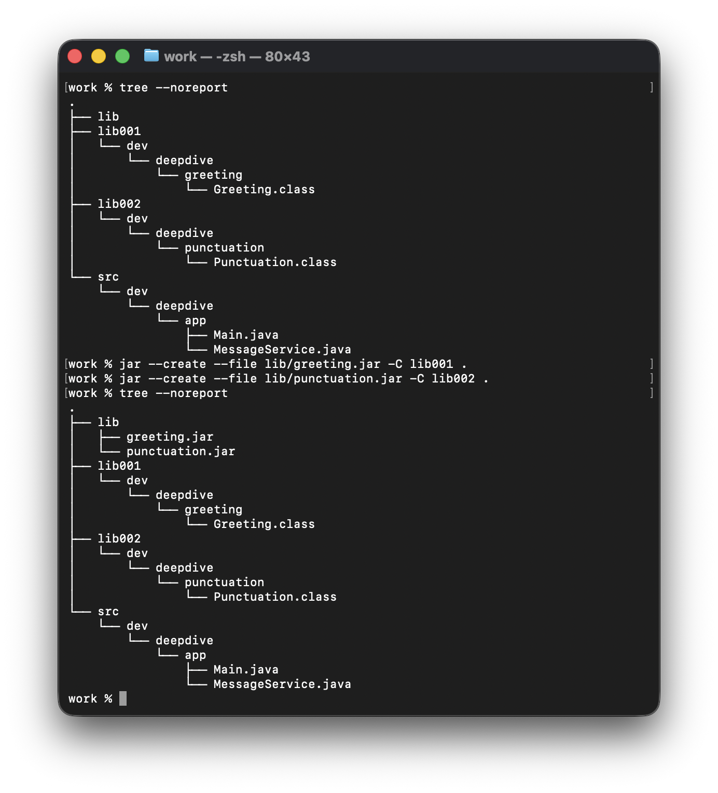
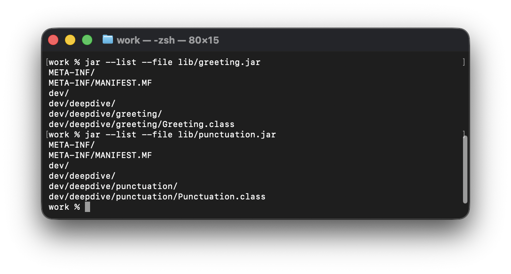
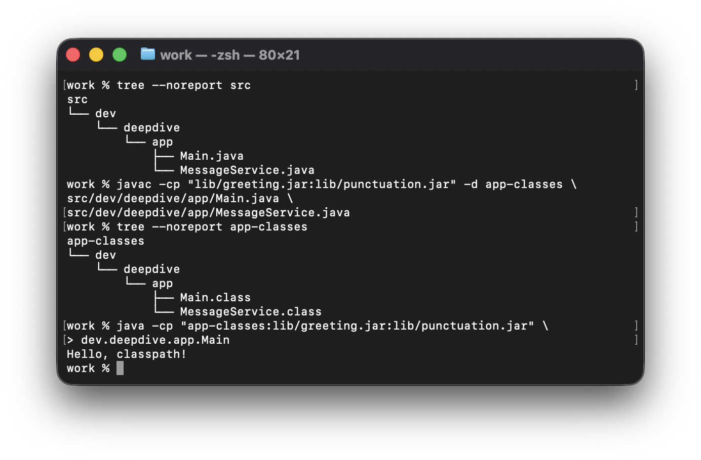
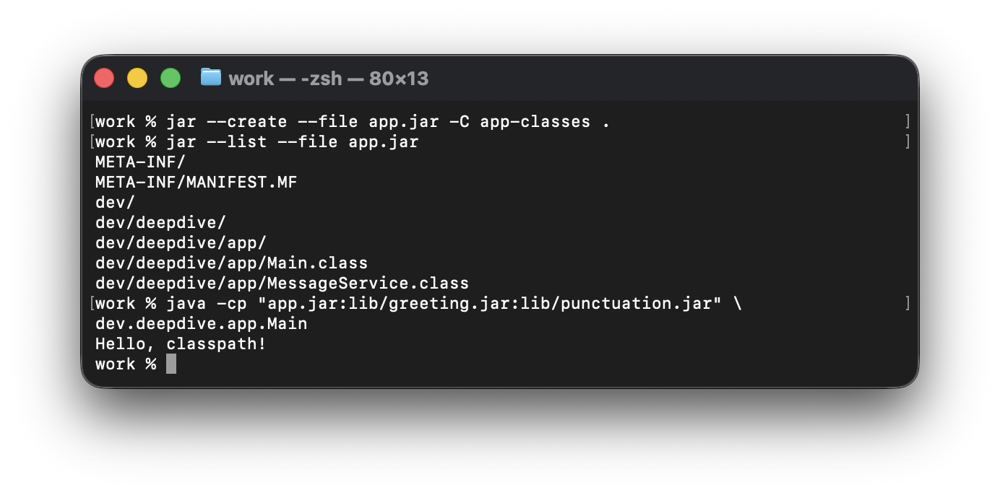
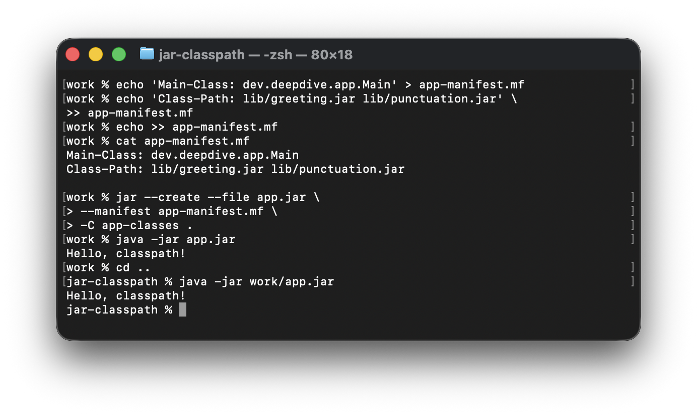

# Java の起動をひもとく：コンパイル、クラスロード、classpath

Java プロジェクトを、`Main.java` と JDK だけにしてみましょう。Eclipse や IntelliJ IDEA、Maven は使わず、Spring も持ち込みません。コンパイルと起動に使うのは `javac` と `java` だけです。

この最小構成から、ソースコードが class ファイルになるまで、起動時に指定したクラス名がディスク上のファイルに結び付くまでをたどります。そのつながりを支えるのが、コンパイル時と実行時それぞれの **classpath** です。

後半では class ファイルを JAR にまとめ、普段の Maven プロジェクトや Spring Boot の実行可能 JAR でも、同じ考え方がどう使われているかを確認します。

コマンドと実行例は JDK 21、macOS の環境によるものです。本文のコマンドは macOS／Linux 向けに記述しています。

## JDK のツールから始める

普段使っている `javac` と `java` は、どちらも JDK が提供するツールです。ここでは `javac` で `.java` ソースファイルを `.class` ファイルへコンパイルし、`java` で JVM を起動して、その結果を読み込み、実行します。

```text
Java ソースコード（.java）
        │
        │ javac
        ▼
Java バイトコード（.class）
        │
        │ java
        ▼
JVM が読み込んで実行
```

> `java Main.java` のようにソースファイルを指定して起動する方法もあります。その場合も実行前にコンパイルが行われます。この記事では、コンパイルと起動を分けて、生成された class ファイルを確認しながら進めます。

## javac で class ファイルを作る

まず、パッケージ宣言のない `Main.java` を用意します。中身は見慣れた `main` メソッドと、出力の一行だけです。

```java
public class Main {
    public static void main(String[] args) {
        System.out.println("Hello, Java!");
    }
}
```

最初のディレクトリには、このファイルしかありません。

```text
step-1/
└── Main.java
```

`step-1` に移動して、コンパイルします。

```bash
javac Main.java
```

成功すると、`Main.class` が増えます。

```text
step-1/
├── Main.class
└── Main.java
```

`javac` は、出力先を指定しなければ、対応するソースファイルと同じディレクトリに class ファイルを生成します。コンパイル結果を別の場所にまとめたい場合は、`-d` で出力先を指定できます。引き続き `step-1` で実行します。

```bash
javac -d out Main.java
```

今度の出力先は `out/Main.class` です。先ほど生成した、ソースファイルの隣にある `Main.class` はそのまま残ります。

```text
step-1/
├── Main.class
├── Main.java
└── out/
    └── Main.class
```

### バイトコードは JVM 向けの中間コード

`Main.class` は、ソースファイルの拡張子だけを変えたものではありません。コンパイラが Java のソースコードを JVM 向けの中間コード、つまりバイトコードに変換した結果です。

ソースコードは人が読み書きしやすい Java の構文で書かれています。一方、class ファイルに収められているのは、JVM が扱う命令やデータです。そのまま読めるテキストではありませんが、CPU が直接実行する機械語でもありません。

ここでコンパイルが境界になります。**JVM が扱うのは Java のソースコードそのものではなく、コンパイル後の class ファイル形式のデータです。**

実際の操作をまとめて見てみましょう。`tree --noreport` で、コンパイル前後のファイルを確認しています。


## カレントディレクトリから Main を起動する

コンパイル結果ができたので、`step-1` でプログラムを起動します。

```bash
java Main
```

出力は次のとおりです。

```text
Hello, Java!
```

これで、最小限のコンパイルと実行ができました。ただし、コンパイルはコードの形式を変えるだけの作業ではありません。`javac` はクラスやメソッドの宣言を参照し、ソースコード中のクラス参照やメソッド呼び出しが成立するかを確認します。実行時には、JVM が実際に使うバイトコードを読み込みます。**どちらの段階もクラスを見つける必要がありますが、その目的は異なります。**

もう一つ、起動コマンドにも違いがあります。生成したファイルは `Main.class` なのに、指定したのはファイル名ではなく、クラス名の `Main` でした。

なぜファイルパスではなくクラス名なのでしょうか。いったんこの違いを覚えておいて、次の実験に進みましょう。パッケージを付けると、違いがはっきりします。

## パッケージを付けて、もう一度起動する

別のディレクトリ `step-2` を用意し、普段のプロジェクトと同じように、パッケージ名に対応する場所に `Main.java` を置きます。コードにはパッケージ宣言を一行追加するだけです。

```java
package dev.deepdive.app;

public class Main {
    public static void main(String[] args) {
        System.out.println("Hello, Java!");
    }
}
```

ソースファイルは最も内側の `app` にあります。

```text
step-2/
└── out/
    └── dev/
        └── deepdive/
            └── app/
                └── Main.java
```

`step-2/out` に移動して、コンパイルします。

```bash
javac dev/deepdive/app/Main.java
```

今回は `-d` を付けていないので、やはりソースファイルの隣に `Main.class` ができます。

```text
out/  ← カレントディレクトリ
└── dev/
    └── deepdive/
        └── app/
            ├── Main.java
            └── Main.class
```

`out` にいる状態で、次のように起動します。

```bash
java dev.deepdive.app.Main
```

出力は同じく `Hello, Java!` です。二つのコマンドを比べると、`javac` にはソースファイルのパス `dev/deepdive/app/Main.java` を渡し、`java` にはパッケージ名を含むクラス名 `dev.deepdive.app.Main` を渡しています。

ここで扱っているような通常のトップレベルクラスでは、この `dev.deepdive.app.Main` がクラスの**バイナリ名**と呼ばれる名前です。通常のディレクトリから探す場合、名前のドットをディレクトリの区切りに置き換え、末尾に `.class` を付けると、ファイルの位置に対応します。

```text
dev.deepdive.app.Main
          │
          ▼
dev/deepdive/app/Main.class
```

`step-1` での `java Main` から、`step-2/out` に移動してパッケージ付きの `Main` をコンパイル、起動するまでの操作です。


では、変換後の `dev/deepdive/app/Main.class` をもう一度見てください。これは相対パスに見えます。だとすれば、どのディレクトリを基準に探すのでしょうか。

## classpath はクラスを探す起点

ここまでのアプリケーションクラスは、通常のディレクトリに class ファイルとして置かれています。クラス名からファイルを見つけるには、探索を始める場所が必要です。その場所を指定するのが **classpath** です。

**一つの classpath には複数のエントリを指定できます。今回の実験では、各エントリはディレクトリであり、クラスファイルを探す起点になります。**

classpath は、プログラムの起動専用の設定ではありません。依存クラスの宣言を調べるコンパイラと、実行するバイトコードを探すランタイムは、それぞれの classpath を使います。コンパイル時の探索先は `javac -cp`、実行時の探索先は `java -cp` で指定します。

まずは、先ほどの `java` コマンドが探索の起点をどう使うのか、見ていきましょう。

### java、JVM、クラスローダー

`java` コマンドは、まず JVM を起動します。Java の仕組みを学ぶと繰り返し登場するのが、**ランタイム（runtime）**という言葉です。ここではプログラムの実行を支える仕組みを指し、JVM は Java ランタイムの中核に当たります。これから見るクラスロードも、その仕事の一つです。

コマンドに続けて指定した `dev.deepdive.app.Main` は、実行の入口となるクラスを表しています。

入口のメソッドを実行するには、クラス名からバイトコードを見つけてメモリに読み込み、JVM 内に対応するクラスを作る必要があります。この役割を担うのが、**クラスローダー（ClassLoader）**です。

今回のように、通常のディレクトリからアプリケーションクラスを探す処理を、疑似コードで表してみます。

```text
relativePath = className.replace(".", "/") + ".class"

for each entry in classpath:  // 複数のエントリが必要になる理由は、後の実験で確認します。
    classFile = joinPath(entry, relativePath)
    if classFile exists:
        bytes = read(classFile)
        return defineClass(className, bytes)

throw ClassNotFoundException
```

クラス名を相対パスに変換し、classpath に指定された各ディレクトリと組み合わせます。ファイルが見つかればバイト列を読み込みます。`defineClass` は、要求されたクラス名とファイル内部に記録されたクラス名の一致を確認し、JVM の機能を使って、実行時のクラスを表す `Class` オブジェクトを作ります。起動に必要な準備が済むと `Main.main` が呼ばれ、私たちのコードに入ります。

これで起動コマンドの役割がつながりました。クラス名は「どのクラスを使うか」、classpath は「どこを探すか」を指定します。クラスローダーはその二つを使って、実際のファイルを見つけます。

### java -cp で探索の起点を指定する

先ほどは、ずっと `step-2/out` にいる状態で次を実行していました。

```bash
java dev.deepdive.app.Main
```

この実験では classpath を別途設定していないため、デフォルトのエントリはカレントディレクトリを表す `.` 一つです。つまり、`out` を起点にクラス名に対応するディレクトリをたどれば、`Main.class` に着きます。

```text
step-2/
└── out/                  ← 探索の起点：カレントディレクトリ
    └── dev/
        └── deepdive/
            └── app/
                ├── Main.java
                └── Main.class  ← ファイルが見つかる
```

コードもファイルも変えずに、カレントディレクトリだけを一つ上の `step-2` に移してみます。同じコマンドでもう一度起動します。

```bash
cd ..
java dev.deepdive.app.Main
```

コマンドは同じでも、探索の起点は変わっています。`.` をそれぞれのカレントディレクトリに置き換え、クラス名に対応するパスをつなぐと違いが分かります。以下は、どちらも `step-2` の階層から書いたパスです。

| カレントディレクトリ | デフォルトの classpath エントリ | 実際に探すパス | 結果 |
| --- | --- | --- | --- |
| `step-2/out` | `.` | `step-2/out/dev/deepdive/app/Main.class` | ファイルがある |
| `step-2` | `.` | `step-2/dev/deepdive/app/Main.class` | ファイルがない |

どちらも classpath は `.` ですが、その意味はコマンドを実行した場所によって変わります。ファイル自体は移していないので、二回目は次のエラーになります。

```text
Error: Could not find or load main class dev.deepdive.app.Main
Caused by: java.lang.ClassNotFoundException: dev.deepdive.app.Main
```

`out` に戻る必要はありません。`step-2` にいたまま、`-cp` で `out` を探索の起点に指定できます。

```bash
java -cp out dev.deepdive.app.Main
```

これで再び起動します。今回の classpath は `out` 一つです。この相対パスはカレントディレクトリの `step-2` を基準に解釈されるため、探索の起点が `step-2/out` に戻ります。

**カレントディレクトリは、classpath 内の相対パスを解釈する基準です。classpath のディレクトリエントリは、クラスを探し始める場所です。** エントリには絶対パスも指定できます。

実際の操作でも、同じ起動コマンドで主クラスが見つからなくなり、`-cp out` を加えると解決しています。


## 一つの classpath に複数のエントリを指定する

疑似コードに残していたコメントを思い出してください。なぜ `for` で繰り返していたのでしょうか。先ほどは `out` だけでしたが、classpath には複数のエントリを指定でき、順番に探索できるからです。

たとえば、他の開発者がコンパイルした `Greeting.class` と `Punctuation.class` を、自分たちのコードとは別々に管理したいとします。二つの依存クラスを、それぞれ `lib001` と `lib002` に置いてみましょう。

自分たちのコードも二つに分けます。起動を担当する `Main.java` と、同じパッケージでメッセージを組み立てる `MessageService.java` です。以降のコンパイルと実行は、次の `deployment` ディレクトリで行います。

```text
deployment/  ← カレントディレクトリ
├── dev/
│   └── deepdive/
│       └── app/
│           ├── Main.java
│           └── MessageService.java
├── lib001/
│   └── dev/
│       └── deepdive/
│           └── greeting/
│               └── Greeting.class
└── lib002/
    └── dev/
        └── deepdive/
            └── punctuation/
                └── Punctuation.class
```

`Main.java` は次のとおりです。

```java
package dev.deepdive.app;

public class Main {
    public static void main(String[] args) {
        System.out.println(MessageService.messageFor("classpath"));
    }
}
```

同じパッケージの `MessageService.java` です。

```java
package dev.deepdive.app;

import dev.deepdive.greeting.Greeting;
import dev.deepdive.punctuation.Punctuation;

final class MessageService {
    private MessageService() {
    }

    static String messageFor(String name) {
        return Greeting.forName(name) + Punctuation.mark();
    }
}
```

外部クラスの仕様は、提供元が決めています。`Greeting.forName("classpath")` は `Hello, classpath` を、`Punctuation.mark()` は `!` を返します。`MessageService` は両者を呼び出して結果をつなぎます。

```text
Main
└── MessageService
    ├── Greeting
    └── Punctuation
```

### コンパイラも依存クラスを探す

`javac` は、ソースコードをバイトコードへ「翻訳」するだけではありません。構文を確認し、型や依存クラスへの参照が正しいかも調べます。

たとえば `Greeting.forName(name)` をコンパイルするには、まず `Greeting` の宣言が必要です。呼び出せる `forName` メソッドがあるか、この引数を渡せるか、戻り値を後続の式で使えるかを確認するためです。`Punctuation.mark()` についても同じです。

自分たちの二つのクラスは、今回 `javac` に渡すソースコードから宣言を取得できます。外部の二つはソースコードを持っていないので、`Greeting.class` と `Punctuation.class` にある型の情報を読み取ります。**ここで必要なのは宣言です。`Greeting.forName` や `Punctuation.mark` を実行するわけではありません。**

まず、コンパイル時の classpath を指定せずに、二つのソースファイルをまとめて渡してみます。

```bash
javac \
  dev/deepdive/app/Main.java \
  dev/deepdive/app/MessageService.java
```

コンパイルは失敗します。中心となるエラーは次の二つです。

```text
package dev.deepdive.greeting does not exist
package dev.deepdive.punctuation does not exist
```

`Main.java` と `MessageService.java` は明示的に渡しています。足りないのは外部クラスの場所です。カレントディレクトリから探しても、`dev/deepdive/greeting/Greeting.class` と `dev/deepdive/punctuation/Punctuation.class` はありません。実際のファイルは、それぞれ `lib001` と `lib002` の下にあります。

ファイルはすでに存在するのに、コンパイラには探索の起点が伝わっていない状態です。


### javac -cp に依存クラスの探索先を渡す

今度は `javac -cp` で、`lib001` と `lib002` を指定します。macOS と Linux ではエントリの区切りにコロン `:` を使います。Windows ではセミコロン `;` なので、この例では `"lib001;lib002"` です。

```bash
javac -cp "lib001:lib002" \
  dev/deepdive/app/Main.java \
  dev/deepdive/app/MessageService.java
```

二つの外部クラスの宣言が見つかり、コンパイルできます。出力先は指定していないので、対応するソースファイルの隣に class ファイルが生成されます。

```text
deployment/
├── dev/
│   └── deepdive/
│       └── app/
│           ├── Main.java
│           ├── Main.class
│           ├── MessageService.java
│           └── MessageService.class
├── lib001/
│   └── dev/
│       └── deepdive/
│           └── greeting/
│               └── Greeting.class
└── lib002/
    └── dev/
        └── deepdive/
            └── punctuation/
                └── Punctuation.class
```

`Main` は `MessageService` を使いますが、先に `MessageService.java` だけをコンパイルしておく必要はありません。**同じ `javac` 呼び出しに渡したソースファイルはまとめてコンパイルされ、互いの宣言を解決する際にファイルの指定順は問いません。** この二つのファイルの順番を入れ替えてもコンパイルできます。

### import に lib001 を足せばよい？

ここまで来ると、別の方法を思い付くかもしれません。`-cp` を指定する代わりに、`MessageService` の `import` を、置き場所に合わせて変えればよいのではないでしょうか。

```diff
-import dev.deepdive.greeting.Greeting;
-import dev.deepdive.punctuation.Punctuation;
+import lib001.dev.deepdive.greeting.Greeting;
+import lib002.dev.deepdive.punctuation.Punctuation;
```

確かに、この名前で `deployment` から探せば、二つの class ファイルに行き着きます。ただし、ファイルを見つけるだけでは不十分です。

`Greeting` の提供元が宣言したパッケージは `dev.deepdive.greeting` です。コンパイル済みの `Greeting.class` にも、クラス名 `dev.deepdive.greeting.Greeting` が記録されています。ファイルを `lib001` に置いても、パッケージ名に `lib001` が加わるわけではありません。こちらの `import` を書き換えても、外部の class ファイルの内容は変わりません。

```text
import が要求するクラス名
lib001.dev.deepdive.greeting.Greeting
                  │
                  ▼
deployment から探索して見つかるファイル
lib001/dev/deepdive/greeting/Greeting.class
                  │
                  ▼
ファイル内部に記録されているクラス名
dev.deepdive.greeting.Greeting
                  │
                  ▼
クラス名が一致しない → コンパイル失敗
```

この場合、コンパイラは `class file contains wrong class` と報告します。ファイルは見つかったものの、要求したクラスではないからです。`Punctuation` も同様です。

したがって `import` は元のままにし、`-cp "lib001:lib002"` で探索の起点を合わせます。**classpath はクラスを探す場所を指定し、`import` はソースコードが参照するクラスを指定します。`import` の変更で外部クラスを改名することはできません。**

### 実行時の classpath は別に指定する

先ほどの `-cp` は、コンパイラに依存クラスの場所を伝える設定でした。コンパイルが済んだら、今度は実行時にも、その場所を伝える必要があります。**`java` は、先ほどの `javac -cp` の設定を引き継ぎません。**

`deployment` で、自分たちの class ファイルと外部クラスの探索先をまとめて指定します。

```bash
java -cp ".:lib001:lib002" dev.deepdive.app.Main
```

これは**一つの classpath に、`.`、`lib001`、`lib002` という三つのエントリを指定したもの**です。

### 実行時には、なぜ . が増えるのか

コンパイル時は `"lib001:lib002"` でしたが、起動時は `".:lib001:lib002"` になっています。追加した `.` は、現在の `deployment` も探索の起点に含める指定です。カレントディレクトリを変更する操作ではありません。

コンパイル時は、`Main.java` と `MessageService.java` のパスを `javac` に直接渡しました。この二つの入力ソースを classpath 経由で探す必要はないので、外部クラスの探索先だけを補えば十分でした。`.` を加えても構いませんが、今回のコンパイルには不要です。

実行時に `java` に渡すのは、入口のクラス名 `dev.deepdive.app.Main` だけです。`Main.class` や、そこから使われる `MessageService.class` のパスを直接渡すわけではありません。この二つは `deployment/dev/deepdive/app/` にあるため、`deployment`、つまり `.` が探索の起点になります。

**`-cp` を指定すると、デフォルトの `.` は自動追加されません。** ここで `"lib001:lib002"` だけを指定したら、入口の `Main` さえ見つかりません。

四つのクラスと、それぞれの探索先を対応させてみましょう。

| 読み込むクラス | 見つかる classpath エントリ | class ファイルの位置（`deployment` 基準） |
| --- | --- | --- |
| `dev.deepdive.app.Main` | `.` | `dev/deepdive/app/Main.class` |
| `dev.deepdive.app.MessageService` | `.` | `dev/deepdive/app/MessageService.class` |
| `dev.deepdive.greeting.Greeting` | `lib001` | `lib001/dev/deepdive/greeting/Greeting.class` |
| `dev.deepdive.punctuation.Punctuation` | `lib002` | `lib002/dev/deepdive/punctuation/Punctuation.class` |

場所と設定が対応し、次の出力が得られます。

```text
Hello, classpath!
```

コンパイルから起動までの操作です。まず `javac -cp "lib001:lib002"` でコンパイルし、生成されたファイルを確認してから、`java -cp ".:lib001:lib002"` で起動しています。


### 実行時の依存クラスを一つ欠かす

次に、実行時の classpath から `lib002` だけを外してみます。

```bash
java -cp ".:lib001" dev.deepdive.app.Main
```

今度はコンパイルエラーではなく、プログラムの実行中にエラーになります。

```text
java.lang.NoClassDefFoundError: dev/deepdive/punctuation/Punctuation
Caused by: java.lang.ClassNotFoundException: dev.deepdive.punctuation.Punctuation
```

この実験では、すでに `Main.main` に入り、`MessageService` と `Greeting` も読み込めています。しかし `Punctuation` が必要になった時点で、現在の classpath からそのクラスを見つけられず、探索は `ClassNotFoundException` になります。実行に必要なクラスを読み込めなかったため、JVM はその例外を原因とする `NoClassDefFoundError` をプログラムに報告します。

`Punctuation.class` を削除したわけではありません。ディスク上には残っています。足りないのは classpath の `lib002` です。コンパイル時に宣言が見つかったからといって、次の起動でもクラスを見つけられるとは限りません。

**ファイルの存在だけでなく、「classpath のディレクトリエントリ ＋ クラス名に対応するパス」が、そのファイルを指しているかを確認する必要があります。**

ディレクトリツリーには `Punctuation.class` が見えていますが、実行時の classpath から `lib002` を外すと、`MessageService.messageFor` でエラーになります。


> デフォルトの classpath は、環境変数 `CLASSPATH` でも設定できます。コマンドの `-cp` が優先され、どちらも設定しなければ `.` 一つです。本文のデフォルト探索先の実験では、この環境変数は設定していません。それ以外の実験では `-cp` で明示しています。

これで二つの段階が分かれました。コンパイル時はソースコードと依存クラスの宣言を使って class ファイルを生成する。実行時は入口のクラス名を指定し、必要なバイトコードを実行時の classpath から見つけられるようにする。設定は別ですが、どちらもクラス名とファイルの配置が対応している必要があります。

## class ファイルを JAR にまとめる

普段の開発で使う外部ライブラリは、ここまでのような個別の class ファイルではなく、JAR で配布されていることが多いはずです。`lib001` と `lib002` を JAR に置き換えると、コンパイルと起動はどう変わるのでしょうか。

**JAR（Java Archive）** は、ZIP 形式をベースにしたアーカイブです。class ファイルやリソースを、内部のディレクトリ構造を保ったまま一つのファイルにまとめられます。クラス名から class ファイルを探す考え方は同じで、探索する場所がディレクトリからアーカイブの中に変わります。

ソースコードを class ファイルにするのは `javac`、既存のファイルをアーカイブに格納するのは、同じく JDK に付属する `jar` コマンドです。**コンパイルはコードの表現を変え、パッケージ化はファイルのまとめ方を変えます。** 元の class ファイルは、JAR を作った後も残ります。

> ライブラリには `xxx-sources.jar` が用意されていることもあります。通常は、コンパイル済みの class ファイルを入れた `xxx.jar` とは別に、対応する `.java` をまとめたものです。IDE で元のソースを読むときや、ソースを見ながらデバッグするときに使います。JAR にはソースとバイトコードを同居させることもできますが、「ソース付き」が常にその形式を意味するわけではありません。本文の起動方法で実行に使われるのは class ファイルであり、ソース JAR はコンパイル済みのライブラリの代わりにはなりません。

引き続き同じ四つのクラスを使いますが、前の実験を残すため、独立した `lab/jar-classpath/work` に移ります。アプリケーションの二つのソースは `src/dev/deepdive/app/`、外部の class ファイルは `lib001` と `lib002` に用意されています。

```text
work/  ← 以降のコマンドを実行するディレクトリ
├── src/dev/deepdive/app/
│   ├── Main.java
│   └── MessageService.java
├── lib001/dev/deepdive/greeting/Greeting.class
├── lib002/dev/deepdive/punctuation/Punctuation.class
└── lib/  ← 作成する依存 JAR の置き場所
```

### jar コマンドを構造で読む

「何をするか」「どの JAR を対象にするか」「入力として何が必要か」の順に読むと、コマンドを整理できます。

```text
jar --create --file 対象のJAR 格納するファイル
jar --list   --file 対象のJAR
```

`--create` はアーカイブの作成、`--list` は既存のアーカイブの内容表示です。`--file` の後には、操作対象の JAR のパスを書きます。作成時なら出力先、一覧表示なら読み込むファイルの指定になります。

作成時は、入力ファイルをどこから取るかも決めます。`-C` を使うと、続く入力ファイルを指定ディレクトリから読み取れます。**C は change directory（ディレクトリの切り替え）と結び付けて覚えるとよいでしょう。** `lib001` の中身を `lib/greeting.jar` にまとめるコマンドは次のとおりです。

```bash
jar --create --file lib/greeting.jar -C lib001 .
```

| コマンドの部分 | この操作での意味 |
| --- | --- |
| `--create` | アーカイブを作成する |
| `--file lib/greeting.jar` | カレントディレクトリの `lib` に JAR を出力する |
| `-C lib001` | 以降の入力ファイルを `lib001` から読み取る |
| `.` | そのディレクトリの内容を、サブディレクトリごと格納する |

**`--file` は JAR の出力先、`-C` は入力ファイルを読む場所です。** `-C` はターミナル自体のカレントディレクトリを変えません。出力先が `lib001/lib/greeting.jar` になるわけでもありません。

最後の `.` は、`-C` で指定した `lib001` を基準に解釈されます。そのため、JAR に入るのは `dev` から始まる内容で、外側の `lib001` は含まれません。クラス名に対応するパスが、そのまま残ります。

二つ目のライブラリも、入力と出力を置き換えるだけです。

```bash
jar --create --file lib/punctuation.jar -C lib002 .
```



内容を確認するには、操作を `--list` に変え、対象を `--file` で指定します。既存の JAR を読むだけなので、入力ファイルの指定は不要です。

```bash
jar --list --file lib/greeting.jar
```

一覧をツリーで表すと、次の構造になっています。

```text
greeting.jar
├── META-INF/
│   └── MANIFEST.MF  ← 今回のパッケージ化で自動生成されたファイル
└── dev/
    └── deepdive/
        └── greeting/
            └── Greeting.class
```

二点に注目しましょう。まず、`Greeting.class` のパスは `dev/deepdive/greeting/Greeting.class` で、元の `lib001` を基準にしたパスと変わりません。

もう一つ、用意していなかった `META-INF/MANIFEST.MF` が増えています。これは今回 `jar` が自動生成したテキストファイルで、**マニフェストファイル**と呼びます。JAR 自体の情報を記録するためのもので、後ほどアプリケーションの起動クラスや依存ファイルの位置を書き込みます。



### JAR を使うときも classpath の考え方は同じ

JAR を作るには入力と内部構造を意識しますが、使う際に新しい手順が増えるわけではありません。**`-cp` のディレクトリエントリを JAR のパスに置き換えるだけで、クラス名もコードもそのままです。**

```text
クラス名：dev.deepdive.greeting.Greeting

ディレクトリエントリ lib001
  → lib001/dev/deepdive/greeting/Greeting.class を探す

JAR エントリ lib/greeting.jar
  → JAR 内の dev/deepdive/greeting/Greeting.class を探す
```

コンパイラも同様です。`work` で、二つの JAR を使ってアプリケーションをコンパイルします。

```bash
javac -cp "lib/greeting.jar:lib/punctuation.jar" -d app-classes \
  src/dev/deepdive/app/Main.java \
  src/dev/deepdive/app/MessageService.java
```

今回は既出の `-d` を使い、コンパイル結果をソースから分離して `app-classes` に置きます。自分たちのクラスはディレクトリ、依存クラスは JAR という組み合わせでも、そのまま起動できます。

```bash
java -cp "app-classes:lib/greeting.jar:lib/punctuation.jar" dev.deepdive.app.Main
```

一つの classpath に、ディレクトリと JAR を混在させて構いません。



アプリケーションも JAR にするなら、先ほどと同じ構造のコマンドを使います。今回は `app-classes` の中身を、カレントディレクトリの `app.jar` に格納します。

```bash
jar --create --file app.jar -C app-classes .
```

起動コマンドは、最初のエントリだけを `app-classes` から `app.jar` に変えます。

```bash
java -cp "app.jar:lib/greeting.jar:lib/punctuation.jar" dev.deepdive.app.Main
```

出力は変わらず `Hello, classpath!` です。三つのエントリがすべて JAR になり、`app.jar` が自分たちの二つのクラスを、残りの JAR が外部クラスを提供します。実行時に JAR 内の class ファイルを読めるので、手動で展開する必要はありません。



### JAR に起動情報を持たせる

普段は `java -jar app.jar` という起動方法も見かけます。この形式では JAR だけを指定し、起動クラスや依存ファイルをコマンドに列挙していません。今のアプリケーションでも、同じように起動できるでしょうか。

そこで使うのが、先ほど見つけた `META-INF/MANIFEST.MF` です。`app.jar` にもこのファイルは生成されていますが、`jar` が自動的に起動クラスを選んだり、依存ファイルの位置を埋めたりするわけではありません。今のままでは `java -jar` で起動できないので、その情報を追加します。

JAR を展開して編集する必要はありません。カレントディレクトリに `app-manifest.mf` というテキストファイルを作り、次の二項目を書いておきます。パッケージ化の際に、これを JAR 内のマニフェストに反映します。

```text
Main-Class: dev.deepdive.app.Main
Class-Path: lib/greeting.jar lib/punctuation.jar

```

`Main-Class` は、どのクラスの `main` メソッドから始めるかを指定します。`Class-Path` は、このアプリケーションが使う外部依存の場所です。依存 JAR を `app.jar` の中にコピーするわけではなく、三つの JAR は独立したままです。

コマンドは、元の `-C` の前に `--manifest app-manifest.mf` を追加するだけです。出力先も入力ディレクトリも変わりません。

```bash
jar --create --file app.jar \
  --manifest app-manifest.mf \
  -C app-classes .
```

これで `app.jar` が作り直され、指定した情報が `META-INF/MANIFEST.MF` に書き込まれます。今度は次のコマンドで起動できます。

```bash
java -jar app.jar
```

`-jar` に渡しているのは、実際に JAR ファイルのパスです。起動クラスと依存ファイルの位置は、マニフェストから取得します。マニフェストの最終行は改行で終えてください。`Class-Path` の複数の位置はスペース区切りであり、コマンドの `-cp` で使ったコロンではありません。

もう一つ重要なのが、相対パスの基準です。ここでの `lib/greeting.jar` と `lib/punctuation.jar` は、**`app.jar` があるディレクトリを基準に解釈されます。起動した場所を基準にするわけではありません。**

だからこそ、`app.jar` と `lib` ディレクトリをセットで配布できます。互いの位置関係が同じなら、マニフェストから依存 JAR を見つけられます。

**`java -jar` では、コマンドの `-cp` 指定は使われません。** `java -cp "lib/greeting.jar:lib/punctuation.jar" -jar app.jar` と書いても、依存クラスの不足は補えません。この例では、マニフェストの `Class-Path` を使います。



## Maven を見直す：依存ファイルの場所とディレクトリの規約

いつもの Maven プロジェクトを思い浮かべてください。ルートの `pom.xml` に依存を宣言し、`src/main/java` にコードを書きます。`mvn compile` を実行すると、バイトコードは `target/classes` に生成されます。通常の JAR プロジェクトなら、`mvn package` で `target` に JAR もできます。

ここまで自分たちで行ったコンパイル、起動、パッケージ化を踏まえると、**Maven がどうやって依存ファイルを見つけ、ソースをコンパイルし、JAR にまとめているか**、大まかに見当が付くのではないでしょうか。

二つに分けて考えられます。**外部の依存ファイルを管理することと、プロジェクト自身のソース、リソース、生成物を管理することです。** 先ほどはコマンドに直接書いた場所を、Maven では設定と規約で扱います。

### 1. 外部依存の管理：必要な JAR はどこにあるか

先ほどは依存ファイルを `lib001`、`lib002` に置き、あるいは `lib` 内の JAR にまとめ、その場所を `-cp` に書きました。Maven では、代わりに名前やバージョンを `pom.xml` に宣言します。Maven はその宣言から、プロジェクトに必要な依存の一覧をそろえます。ここで扱う通常の Java ライブラリなら、実体は主に JAR ファイルです。

これらを一つずつプロジェクトに置く必要はありません。Maven は**ローカルリポジトリ**に依存ファイルを保存し、複数のプロジェクトで再利用します。デフォルトではホームディレクトリの `.m2/repository` にあり、名前やバージョンなどに従って整理されています。必要な JAR がなければ、通常はリモートリポジトリからダウンロードして保存します。

必要な依存の一覧と保存先が分かれば、Maven は JAR の実際のパスを取り出して、その段階の classpath を組み立てられます。**依存ファイルを探し、そのパスを `-cp` に書いていた作業に相当します。** プロジェクトの設定を基にできるため、私たちが一つずつ転記する必要はありません。

classpath を組み立てられるなら、用途別に異なる一覧を用意することもできます。主コードのコンパイル、テストコードのコンパイル、アプリケーションの実行で、同じ依存一覧を使う必要はないからです。

依存の `scope` は、**その依存をどの用途の classpath に含めるか**を指定するものです。たとえばテストコードで使う JUnit には、`<scope>test</scope>` を指定します。テストコードのコンパイル時には JUnit が含まれ、主コードのコンパイル時には含まれません。二種類のソースに対して、異なるコンパイル用の依存を用意できます。

### 2. プロジェクトファイルの管理：ソースと生成物をどこに置くか

デフォルトの規約に従う通常の Maven JAR プロジェクトでは、ソースと典型的な生成物は次の位置にあります。

```text
project/
├── pom.xml
├── src/
│   ├── main/
│   │   ├── java/             ← 主コード。以下は package に沿った構造
│   │   └── resources/        ← 主コードが使う設定ファイルなど
│   └── test/
│       ├── java/             ← テストコード。以下も package に沿った構造
│       └── resources/        ← テスト用のリソース
└── target/                   ← ビルド生成物。バイトコード以外も含む
    ├── classes/              ← 主コードの class ファイルとリソース
    ├── test-classes/         ← テストコードの class ファイルとリソース
    └── example-1.0.0.jar     ← 名前はプロジェクトの設定による
```

二段階で見ると整理しやすくなります。`main` と `test` は用途の区分、`java` と `resources` はソースとリソースの区分です。ビルドでは、ソースはコンパイルし、リソースは通常、相対パスを保って出力先にコピーします。結果はそれぞれ `target/classes` と `target/test-classes` に集まります。

これは、先ほどの `javac -d app-classes` と同じ種類の指定です。私たちは `app-classes` を選びましたが、Maven プロジェクトではデフォルトで `target` を生成物の置き場所とし、主コードを `target/classes`、テストコードを `target/test-classes` に出力します。

`src/main/java` はパッケージ名の一部ではありません。`dev.deepdive.app.Main` のソースは、その下の `dev/deepdive/app/Main.java` にあり、コンパイル後は `target/classes/dev/deepdive/app/Main.class` に置かれます。実行時の探索の起点は `target/classes` です。クラス名に `src`、`main`、`java` を加える必要はありません。

### ビルドを、すでに分かっている操作に置き換える

依存の場所とディレクトリの規約が分かると、通常の Java プロジェクトのビルドを、ここまでの操作に対応させられます。

| ビルドで行うこと | ここまでの知識で捉えると |
| --- | --- |
| 主コードのコンパイル | 主ソース、コンパイル用の classpath、出力先 `target/classes` をコンパイラに渡す |
| テストコードのコンパイル | 主コードの出力とテスト用依存を classpath に含め、結果を `target/test-classes` に出力する |
| 通常の JAR の作成 | `target/classes` の主コードとリソースをまとめる。デフォルトではテストクラスや外部依存 JAR は入らない |

二種類のコンパイルは、入力ソース、依存一覧、出力先が異なる `javac -cp … -d …` と捉えられます。パッケージ化のファイル構成は、`jar --create --file … -C target/classes .` に相当します。これは各段階で必要な情報を対応付けたものであり、Maven が必ずこのコマンドを一行ずつ実行するという意味ではありません。

いつものコマンドも、生成物と結び付けて読めます。`mvn compile` は主コードの class ファイルを生成し、`mvn test-compile` はテストコードのコンパイルまで進めます。デフォルトの通常の JAR プロジェクトでは、`mvn package` が成功すると、`target` にパッケージができます。入力、依存、出力先は Maven が設定と規約から決めます。

では、普段はどうやって Maven プロジェクトを起動しているのでしょうか。Maven には、あらゆるアプリケーションに共通する標準の起動コマンドがあるわけではありません。多くの場合は IDE で入口のクラスを選び、実行をクリックしています。IDE は Maven の設定から、コンパイル済みのクラスのディレクトリと、実行に必要な JAR のパスを classpath にまとめ、選んだクラスを起動します。

自分でターミナルから `java -cp` を実行するなら、やはり必要な classpath を指定します。依存が二つなら手書きでも十分ですが、数十、数百になると煩雑で、抜けも起こりやすくなります。そのため通常はツールでパスを生成します。**ワンクリック起動が省いているのは、コマンドを手で組み立てる作業です。classpath 自体が不要になったわけではありません。**

Maven を使っても、クラス名とファイルの対応関係は変わりません。手作業で決めていた探索先、コンパイル出力、アーカイブの中身が、再利用できる規約と設定になったと捉えられます。

### JAR ができたら、そのままサーバーで起動できるか

`mvn package` でできた JAR をサーバーにコピーすれば、先ほどと同じように `java -jar` で起動できるでしょうか。

先ほどは class ファイルをまとめるだけでなく、マニフェストに起動クラスと依存ファイルの場所を指定しました。**通常の Maven JAR プロジェクトでは、デフォルトのパッケージ化だけで `Main-Class` や依存の `Class-Path` が自動設定されるわけではありません。** 同じ起動方法を使うなら、この設定が必要です。

マニフェストを補っても、もう一つ残ります。依存ファイルは開発環境のローカルリポジトリにあるので、アプリケーションの JAR だけをコピーしても、サーバーには届きません。マニフェストのパスは、配布先に実際にあるファイルを指す必要があります。

たとえば、配布物を次の構成にそろえます。

```text
release/
├── app.jar
└── lib/
    ├── greeting-1.0.0.jar
    ├── punctuation-1.0.0.jar
    └── … その他の実行時依存
```

マニフェストの `Class-Path` には `lib/greeting-1.0.0.jar` のような相対パスを書きます。`release` を一式で配布すれば、アプリケーションと依存ファイルの位置関係は保たれます。サーバーに開発環境のローカルリポジトリを再現する必要はありません。

この構成も手作業でそろえる必要はありません。**Maven には、実行に必要な依存を集め、マニフェストを生成し、配布用アーカイブにまとめる手段があります。** 設定しておけば、ビルドで配布物を生成できます。アプリケーションと依存のクラスやリソースを一つの JAR に統合し、起動クラスを設定する方法もあります。

具体的な設定は文末の資料を参照できます。ここでは、どの形式でも、起動時に探す場所と配布物の実際の配置を対応させることが要点です。

## Spring Boot を見直す：一つの JAR にアプリケーションと依存を収める

Spring Boot のデプロイでは、実行可能 JAR を一つコピーして `java -jar` で起動する形をよく使います。別の `lib` ディレクトリを添えたり、依存のパスを一つずつ列挙したりする必要はありません。ここも、ファイルの配置と起動クラスの二つに分けて見てみましょう。以下は Spring Boot 3.5 の標準的な実行可能 JAR の構成です。

### 1. ファイルの配置：アプリケーションと依存を同じ JAR に入れる

Spring Boot のパッケージ化を設定すると、アプリケーションクラスと実行時の依存が一つの JAR にまとめられます。依存はそれぞれ JAR のまま格納され、中のクラスを展開して統合するわけではありません。先ほどのクラス名で表すと、クラスの探索に関わる構造は次のようになります。

```text
app.jar
├── META-INF/
│   └── MANIFEST.MF
├── org/springframework/boot/loader/
│   └── … ランチャーの class ファイル
└── BOOT-INF/
    ├── classes/
    │   └── dev/deepdive/app/
    │       ├── Main.class
    │       └── MessageService.class
    └── lib/
        ├── greeting-1.0.0.jar
        ├── punctuation-1.0.0.jar
        └── … Spring Boot などの依存 JAR
```

自分たちのクラスは `BOOT-INF/classes`、依存 JAR は `BOOT-INF/lib` にあります。別々に配布していたアプリケーションと `lib` の内容が、一つのファイルに収まっています。

### 2. 起動：ランチャーからアプリケーションの入口へ

アプリケーションクラスの前には `BOOT-INF/classes` が加わり、依存 JAR も JAR の内部に入っています。この配置からどうやって起動するのでしょうか。マニフェストには、次の二つが記録されます。

```text
Main-Class: org.springframework.boot.loader.launch.JarLauncher
Start-Class: dev.deepdive.app.Main
```

`java -jar` が読むのは、ここでも `Main-Class` です。ただし、最初に呼ばれるのは Spring Boot の `JarLauncher` です。このクラスはアーカイブのルートから `org/springframework/boot/loader/launch/` というパスにあり、先ほどの規則で見つけられます。

`JarLauncher` は Boot の配置を理解しており、`BOOT-INF/classes` と `BOOT-INF/lib` 内の依存 JAR を探索対象にします。そのうえで `Start-Class` を読み、自分たちの入口クラスの `main` メソッドを呼び出します。**探索する場所を整えるコードを先に実行し、そこからアプリケーションに入る**、という一段が加わっています。

```text
java -jar app.jar
        │
        ▼
Main-Class → Spring Boot のランチャー
        │
        ├── アプリケーションクラス：BOOT-INF/classes
        ├── 依存クラス：BOOT-INF/lib 内の各 JAR
        │
        ▼
Start-Class → dev.deepdive.app.Main.main
```

## まとめ方が変わっても、探すための関係は変わらない

手動の `javac` と `java` から、Maven のビルド、Spring Boot の実行可能 JAR まで、追ってきたのは同じ流れです。**ソースを class ファイルに変換し、入口のクラスと、そこから使うクラスを見つけられるようにする。** ツールが依存、出力先、起動情報を整理しても、クラス名と実際のファイルを結ぶ関係は残っています。

次は、使い慣れたプロジェクトを開いて、コンパイル出力、パッケージの中身、実際の起動コマンドを見てみてください。入口のクラスは何か。必要なクラスはどこにあるか。その場所をつないでいるのは、どの設定、あるいはどの起動コードか。ソースから実行までの道筋を、この記事の知識でたどれるはずです。

## 参考資料

- [Oracle JDK 21：javac、複数ソースのコンパイルと型宣言の探索](https://docs.oracle.com/en/java/javase/21/docs/specs/man/javac.html)
- [Oracle JDK 21：java と classpath](https://docs.oracle.com/en/java/javase/21/docs/specs/man/java.html)
- [Oracle Java SE 21：ClassLoader API](https://docs.oracle.com/en/java/javase/21/docs/api/java.base/java/lang/ClassLoader.html)
- [Java 仮想マシン仕様 21：class ファイル形式](https://docs.oracle.com/javase/specs/jvms/se21/html/jvms-4.html)
- [Java 仮想マシン仕様 21：ユーザー定義クラスローダーによるクラスの作成](https://docs.oracle.com/javase/specs/jvms/se21/html/jvms-5.html#jvms-5.3.2)
- [Oracle JDK 21：jar コマンド](https://docs.oracle.com/en/java/javase/21/docs/specs/man/jar.html)
- [Oracle JDK 21：JAR ファイル仕様](https://docs.oracle.com/en/java/javase/21/docs/specs/jar/jar.html)
- [Maven Source Plugin：ソース JAR の生成](https://maven.apache.org/plugins/maven-source-plugin/usage.html)
- [Maven：標準ディレクトリレイアウト](https://maven.apache.org/guides/introduction/introduction-to-the-standard-directory-layout.html)
- [Maven：依存関係の仕組み](https://maven.apache.org/guides/introduction/introduction-to-dependency-mechanism.html)
- [Maven：ビルドライフサイクル](https://maven.apache.org/guides/introduction/introduction-to-the-lifecycle.html)
- [Maven JAR Plugin：JAR に格納するディレクトリ](https://maven.apache.org/plugins/maven-jar-plugin/jar-mojo.html)
- [Maven Archiver：マニフェストの起動クラスと依存パス](https://maven.apache.org/shared/maven-archiver/examples/classpath.html)
- [Maven Dependency：依存ファイルの収集](https://maven.apache.org/plugins/maven-dependency-plugin/copy-dependencies-mojo.html)
- [Maven Assembly：配布用アーカイブの作成](https://maven.apache.org/plugins/maven-assembly-plugin/)
- [Maven Shade：アプリケーションと依存の統合](https://maven.apache.org/plugins/maven-shade-plugin/)
- [Spring Boot 3.5：ネストした JAR の構造](https://docs.spring.io/spring-boot/3.5/specification/executable-jar/nested-jars.html)
- [Spring Boot 3.5：実行可能 JAR の起動](https://docs.spring.io/spring-boot/3.5/specification/executable-jar/launching.html)
- [Spring Boot 3.5：実行可能 JAR のパッケージ化](https://docs.spring.io/spring-boot/3.5/maven-plugin/packaging.html)
